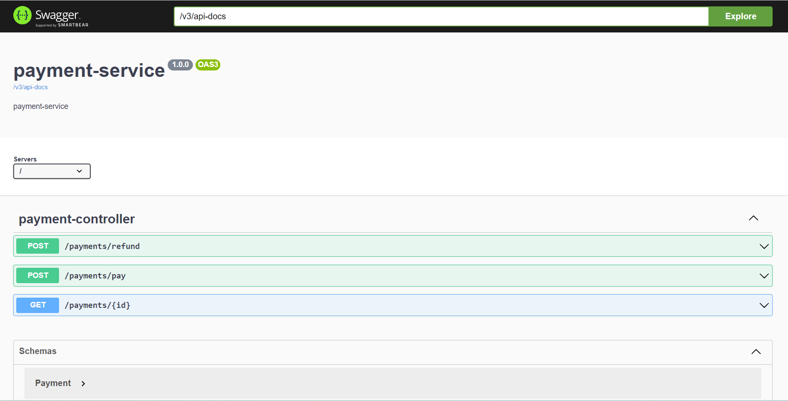

# Hotel Reservation System - Hotel Management Service

[](https://sonarcloud.io/summary/new_code?id=arghyagiri_hrs-hotelRoom-service)
[](http://www.apache.org/licenses/LICENSE-2.0.html)

### Hotel Management Service
#### Business Workflows:

* Add/Update Room Inventory
* Add/Update Amenities
* View Reservations

####  Design Patterns & Annotations
* Use Proxy pattern to interact with third-party inventory systems.
* Interactions: Will interact with Reservation Service.

[Spring Boot](http://projects.spring.io/spring-boot/) based app.

## Requirements

For building and running the application you need:

- [JDK 17](https://www.oracle.com/java/technologies/javase/jdk17-archive-downloads.html)
- [Maven 3](https://maven.apache.org)

## Running the application locally

There are several ways to run a Spring Boot application on your local machine. One way is to execute the `main` method
in the `com.tcs.training.hotelRoom.HotelManagementApplication` class from your IDE.

Alternatively you can use
the [Spring Boot Maven plugin](https://docs.spring.io/spring-boot/docs/current/reference/html/build-tool-plugins-maven-plugin.html)
like so:

```shell
mvn spring-boot:run
```

## Local Application Urls

### Base Url

http://localhost:<random port assigned>
check eureka running on port 8762 to find the right port

### Swagger UI

http://localhost:<port mentioned above>/swagger-ui/index.html



## Application endpoints:

* Initiate a hotelRoom: ```POST /payments/pay```
* Initiate a refund: ```POST /payments/refund```
* See a hotelRoom information by hotelRoom id: ```GET /payments/{id}```

## API Test

[Postman Scripts](./postman/Payment%20Service.postman_collection.json)


## Copyright

Released under the Apache License 2.0. See
the [LICENSE](https://github.com/arghyagiri/microservice-e2/blob/main/LICENSE) file.

